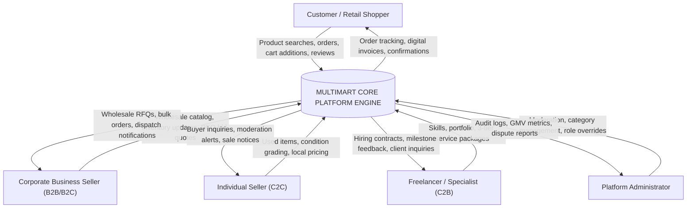
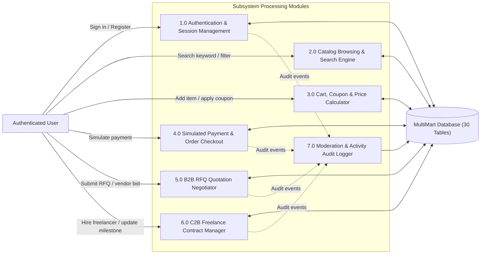

# DATA FLOW DIAGRAMS (DFD)
**Project Title:** MultiMart Multi-Model E-Commerce Platform  

---

## 1. Level-0 DFD (Context Analysis Diagram)

```mermaid
flowchart TD
    Customer["Customer / Retail Shopper"]
    BizSeller["Corporate Business Seller (B2B/B2C)"]
    IndSeller["Individual Seller (C2C)"]
    Freelancer["Freelancer / Specialist (C2B)"]
    Admin["Platform Administrator"]

    System[("MULTIMART CORE PLATFORM ENGINE")]

    Customer -->|Product searches, orders, cart additions, reviews| System
    System -->|Order tracking, digital invoices, confirmations| Customer

    BizSeller -->|Wholesale catalog, inventory updates, RFQ bid quotes| System
    System -->|Wholesale RFQs, bulk orders, dispatch notifications| BizSeller

    IndSeller -->|Used items, condition grading, local pricing| System
    System -->|Buyer inquiries, moderation alerts, sale notices| IndSeller

    Freelancer -->|Skills, portfolio, 3-tier service packages| System
    System -->|Hiring contracts, milestone feedback, client inquiries| Freelancer

    Admin -->|Moderation, category management, role overrides| System
    System -->|Audit logs, GMV metrics, dispute reports| Admin
```

---

## 2. Level-1 DFD (Major Subsystem Processes)

```mermaid
flowchart LR
    U["Authenticated User"]
    
    subgraph Processes["Subsystem Processing Modules"]
        P1["1.0 Authentication & Session Management"]
        P2["2.0 Catalog Browsing & Search Engine"]
        P3["3.0 Cart, Coupon & Price Calculator"]
        P4["4.0 Simulated Payment & Order Checkout"]
        P5["5.0 B2B RFQ Quotation Negotiator"]
        P6["6.0 C2B Freelance Contract Manager"]
        P7["7.0 Moderation & Activity Audit Logger"]
    end

    DB[("MultiMart Database (30 Tables)")]

    U -->|Sign in / Register| P1
    P1 <--> DB

    U -->|Search keyword / filter| P2
    P2 <--> DB

    U -->|Add item / apply coupon| P3
    P3 <--> DB

    U -->|Simulate payment| P4
    P4 <--> DB

    U -->|Submit RFQ / vendor bid| P5
    P5 <--> DB

    U -->|Hire freelancer / update milestone| P6
    P6 <--> DB

    P1 & P4 & P5 & P6 -.->|Audit events| P7
    P7 --> DB
```
